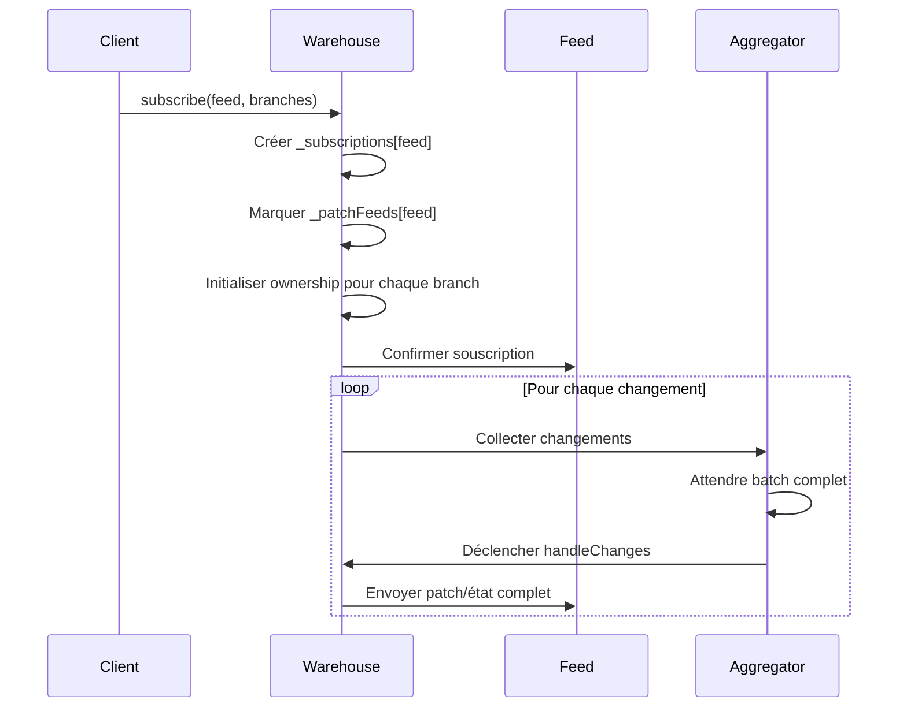

# Warehouse Ownerships et Feeds

## Aperçu

Le module `goblin-warehouse` constitue le système central de gestion d'état et de souscriptions du framework Xcraft. Il implémente un mécanisme sophistiqué d'**ownership** (propriété) et de **feeds** (flux de données) qui permet de gérer le cycle de vie des acteurs et la distribution des changements d'état à travers l'application.

Le warehouse fonctionne comme un registre centralisé où chaque acteur (identifié par une **branch**) peut être rattaché à un ou plusieurs **feeds** via des relations de parenté. Ce système garantit qu'un acteur reste en vie tant qu'au moins un parent le référence dans au moins un feed, et qu'il soit automatiquement collecté par le garbage collector lorsque plus aucune référence n'existe.

## Sommaire

### Concepts fondamentaux

- [Structure des données](#structure-des-données)
- [Branches et identifiants](#branches-et-identifiants)
- [Feeds et souscriptions](#feeds-et-souscriptions)
- [Relations d'ownership](#relations-downership)

### Fonctionnement du système

- [Cycle de vie des acteurs](#cycle-de-vie-des-acteurs)
- [Mécanisme de garbage collection](#mécanisme-de-garbage-collection)
- [Propagation des changements](#propagation-des-changements)
- [Gestion des patches](#gestion-des-patches)

### Opérations avancées

- [Attachement et détachement](#attachement-et-détachement)
- [Greffage entre feeds](#greffage-entre-feeds)
- [Outils de diagnostic](#outils-de-diagnostic)

## Fonctionnement

### Structure des données

Le warehouse maintient un état global structuré autour de plusieurs collections principales :

**`_subscriptions`** : Contient l'ensemble des feeds actifs et leurs branches souscrites. Chaque feed possède une collection de branches avec leurs relations de parenté (parents/children) et optionnellement des vues spécifiques.

**`_generations`** : Stocke les numéros de génération de chaque branch, utilisés pour la synchronisation et la détection des changements. Inclut également un flag `hasDispatched` indiquant si l'acteur a terminé son initialisation.

**`_creators`** : Maintient une référence vers l'acteur créateur de chaque branch, utilisée pour la gestion du cycle de vie et le debugging.

**`_patchFeeds`** : Liste des feeds configurés pour recevoir des patches différentiels plutôt que l'état complet.

**`_feedsAggregator`** : Agrégateur qui collecte les changements par batch avant de les diffuser aux feeds concernés, optimisant les performances réseau.

### Branches et identifiants

Une **branch** représente l'identifiant unique d'un acteur dans le système. Elle peut prendre deux formes :

- **Singleton** : Identifiant simple sans suffixe (ex: `goblin-desktop`)
- **Instance** : Identifiant avec suffixe d'instance (ex: `goblin-desktop@main-desktop`)

Les singletons sont des acteurs uniques qui persistent durant toute la durée de vie de l'application. Les instances sont des acteurs qui peuvent être créés et détruits dynamiquement. Le système traite différemment ces deux types, notamment pour la garbage collection où les singletons ne peuvent pas être supprimés.

### Feeds et souscriptions

Un **feed** constitue un canal de distribution des changements d'état. Chaque feed maintient sa propre vue des branches qui l'intéressent et reçoit uniquement les notifications concernant ces branches.

Le processus de souscription établit une relation bidirectionnelle :

- Le feed déclare son intérêt pour certaines branches
- Le warehouse enregistre cette souscription et commence à tracker les changements
- Des vues partielles peuvent être définies pour filtrer les propriétés transmises



### Relations d'ownership

Le système d'ownership repose sur des relations parent-enfant entre les branches. Chaque branch maintient deux collections :

**`parents`** : Liste des branches qui "possèdent" cette branch. Une branch reste vivante tant qu'elle a au moins un parent dans au moins un feed. Un parent spécial `'new'` est utilisé temporairement lors de la création.

**`children`** : Liste des branches "possédées" par cette branch. Quand une branch est supprimée, ses enfants orphelins sont automatiquement collectés en cascade.

Ces relations forment un graphe dirigé où les arêtes représentent les dépendances. Le garbage collector utilise ce graphe pour déterminer quelles branches peuvent être supprimées en toute sécurité. Le système supporte l'auto-ownership (une branch peut être son propre parent) pour les acteurs racines.

### Cycle de vie des acteurs

Le cycle de vie d'un acteur dans le warehouse suit plusieurs étapes distinctes :

**Création** : Lors de l'upsert initial avec `isCreating: true`, l'acteur est enregistré avec un parent spécial `'new'` et un créateur. Cette phase temporaire permet d'éviter la collection immédiate pendant l'initialisation.

**Attachement** : L'acteur est rattaché à ses parents définitifs via `attach-to-parents`. Le parent `'new'` est supprimé une fois l'attachement confirmé via `del-creator`.

**Vie active** : L'acteur reçoit des mises à jour d'état via des upserts successifs. Ses relations de parenté peuvent évoluer dynamiquement. Seuls les acteurs avec `hasDispatched: true` sont inclus dans les feeds.

**Suppression** : L'acteur est détaché de ses parents via `detach-from-parents` ou `delete-branch`. Si plus aucun parent ne le référence, il devient éligible à la collection.

**Collection** : Le garbage collector supprime l'acteur de tous les feeds et émet un événement `warehouse.released` pour notifier les autres composants.

```mermaid
sequenceDiagram
    participant Actor
    participant Warehouse
    participant GC as Garbage Collector
    participant Feeds

    Actor->>Warehouse: upsert(branch, isCreating=true, creator)
    Warehouse->>Warehouse: Créer avec parent 'new'
    Warehouse->>Warehouse: Stocker créateur

    Actor->>Warehouse: attach-to-parents(branch, realParents)
    Warehouse->>Warehouse: Attacher aux vrais parents

    Actor->>Warehouse: del-creator(branch)
    Warehouse->>Warehouse: Supprimer parent 'new'
    Warehouse->>Warehouse: Supprimer créateur

    loop Vie active
        Actor->>Warehouse: upsert(branch, data, hasDispatched=true)
        Warehouse->>Feeds: Propager changements (si hasDispatched)
    end

    Actor->>Warehouse: delete-branch(branch)
    Warehouse->>GC: Détacher de tous parents
    GC->>GC: Collection en cascade des orphelins
    GC->>GC: Supprimer branches collectées
    GC->>Feeds: Émettre warehouse.released
```

### Mécanisme de garbage collection

Le garbage collector implémente un algorithme de collecte en cascade sophistiqué qui garantit la cohérence des références :

**Détection des orphelins** : Quand une branch perd son dernier parent dans un feed, elle devient orpheline dans ce feed et est marquée pour collection. Le système vérifie d'abord si la branch existe dans d'autres feeds.

**Collection en cascade** : La suppression d'une branch déclenche la vérification récursive de tous ses enfants. Ceux qui deviennent orphelins sont ajoutés à la liste de collection dans une boucle jusqu'à stabilisation.

**Auto-release pour les orcs** : Les branches commençant par `goblin-orc@` bénéficient d'un mécanisme d'auto-release qui les supprime immédiatement de l'état global sans attendre l'acknowledge.

**Collection différée** : Les branches collectées sont ajoutées à une liste `_collectable` avec leur génération. Un système de debounce (50ms) et de traitement par batch (50 branches) optimise l'émission des événements `warehouse.released`.

**Nettoyage final** : Les composants externes peuvent réagir à l'événement `released` pour effectuer leur propre nettoyage avant que la branch soit définitivement supprimée via `acknowledge`.

### Propagation des changements

Le système de propagation utilise un mécanisme d'agrégation sophistiqué pour optimiser les performances :

**Agrégation des changements** : Les modifications sont collectées par le `MapAggregator` avec un délai de 50ms avant traitement. Cela évite les envois multiples pour des changements rapprochés.

**Calcul des patches** : Pour les feeds configurés en mode patch, le warehouse maintient un historique des états précédents (`previousBranchStates`) et calcule les différences via `xcraft-immutablediff`.

**Distribution ciblée** : Chaque feed ne reçoit que les changements concernant les branches auxquelles il est souscrit. Le système vérifie également le flag `hasDispatched` pour les instances.

**Gestion des vues** : Les feeds peuvent définir des vues partielles avec `with` (propriétés incluses) ou `without` (propriétés exclues) pour ne recevoir qu'un sous-ensemble des propriétés de chaque branch.

**Optimisation des changements vides** : Le système compare les états avec `changeFeeds` pour éviter d'envoyer des patches identiques.

### Gestion des patches

Le système de patches permet d'optimiser la bande passante en n'envoyant que les changements plutôt que l'état complet :

**Mode complet** : Lors de la première souscription ou après `resend`, le feed reçoit l'état complet de toutes ses branches avec `_xcraftPatch: false` et un numéro de génération.

**Mode patch** : Les changements ultérieurs sont envoyés sous forme de patches différentiels avec `_xcraftPatch: true`. Les patches peuvent contenir `false` pour indiquer une suppression.

**Synchronisation** : Chaque envoi inclut un numéro de génération incrémental qui permet au destinataire de détecter les messages perdus ou désordonnés.

**Resynchronisation** : La commande `resend` permet de forcer l'envoi de l'état complet pour resynchroniser un feed après une déconnexion.

**Gestion des feeds morts** : Le système détecte automatiquement les feeds qui n'existent plus et évite d'envoyer des changements vers des destinations inexistantes.

### Attachement et détachement

Les opérations d'attachement et de détachement permettent de modifier dynamiquement les relations d'ownership :

**Attachement multiple** : Une branch peut être attachée à plusieurs parents simultanément dans différents feeds, créant une redondance qui améliore la robustesse.

**Validation des parents** : Le système vérifie que les parents existent avant d'établir les relations. Si un parent est manquant, un avertissement est émis et la branch peut être immédiatement collectée.

**Détachement sélectif** : Le détachement peut cibler des parents spécifiques ou utiliser des patterns avec wildcards pour des opérations en masse.

**Gestion des feeds auto-nommés** : Quand une branch porte le même nom qu'un feed, la suppression de cette branch déclenche automatiquement l'unsubscribe du feed entier.

**Nettoyage automatique** : Quand une branch n'a plus de parents dans un feed, elle est automatiquement collectée pour éviter les fuites mémoire.

### Greffage entre feeds

L'opération de greffage (`graft`) permet de copier une sous-arborescence d'un feed vers un autre :

**Copie récursive** : Le greffage copie non seulement la branch cible mais aussi tous ses parents nécessaires de manière récursive.

**Préservation des relations** : Les relations parent-enfant sont recréées dans le feed de destination, mais les enfants sont réinitialisés pour éviter les références croisées.

**Isolation** : Les modifications dans le feed source n'affectent pas la copie dans le feed de destination après le greffage.

Cette fonctionnalité est particulièrement utile pour créer des vues isolées ou pour migrer des données entre contextes différents sans perdre la structure hiérarchique.

### Outils de diagnostic

Le warehouse fournit plusieurs outils pour diagnostiquer et déboguer les problèmes :

**Détection des orphelins** : La commande `checkOrphan` identifie les branches qui référencent des parents inexistants, révélant des problèmes de synchronisation.

**Détection des branches pendantes** : La commande `checkDangling` trouve les branches présentes dans l'état global mais absentes de tous les feeds.

**Visualisation graphique** : La commande `graph` génère des représentations DOT des relations d'ownership, permettant une analyse visuelle des dépendances avec support de différents layouts (fdp pour vue simple, dot pour vue complexe).

**Inspection de l'état** : La commande `status` affiche un résumé structuré des souscriptions et générations pour un debugging rapide.

**Requêtes avancées** : La commande `query` permet d'effectuer des recherches complexes avec filtres et projections sur les données du warehouse.

**Interface d'exploration** : Le widget `warehouse-explorer` fournit une interface graphique interactive pour visualiser les feeds, leurs souscriptions et les relations entre branches sous forme d'arbre et de graphe utilisant Cytoscape avec layout Dagre.

**Métriques de performance** : Le système expose des métriques sur le nombre de branches par feed et le total d'entrées pour le monitoring.

**Synchronisation forcée** : La commande `syncChanges` permet de forcer la libération immédiate des changements en attente pour un feed spécifique.

Ces outils sont essentiels pour maintenir la santé du système et identifier rapidement les problèmes de cohérence ou de performance.

---

_Ce document a été généré automatiquement à partir du code source et mis à jour pour refléter l'état actuel du module._