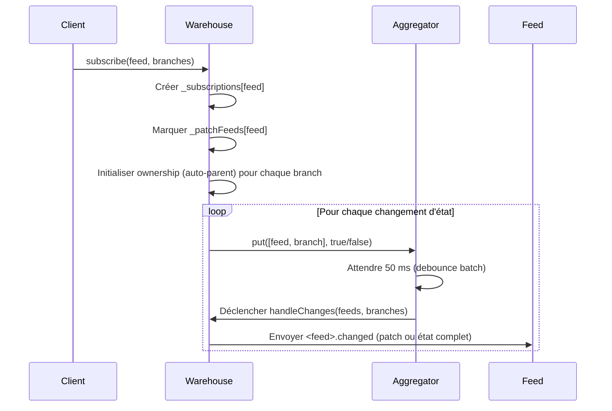
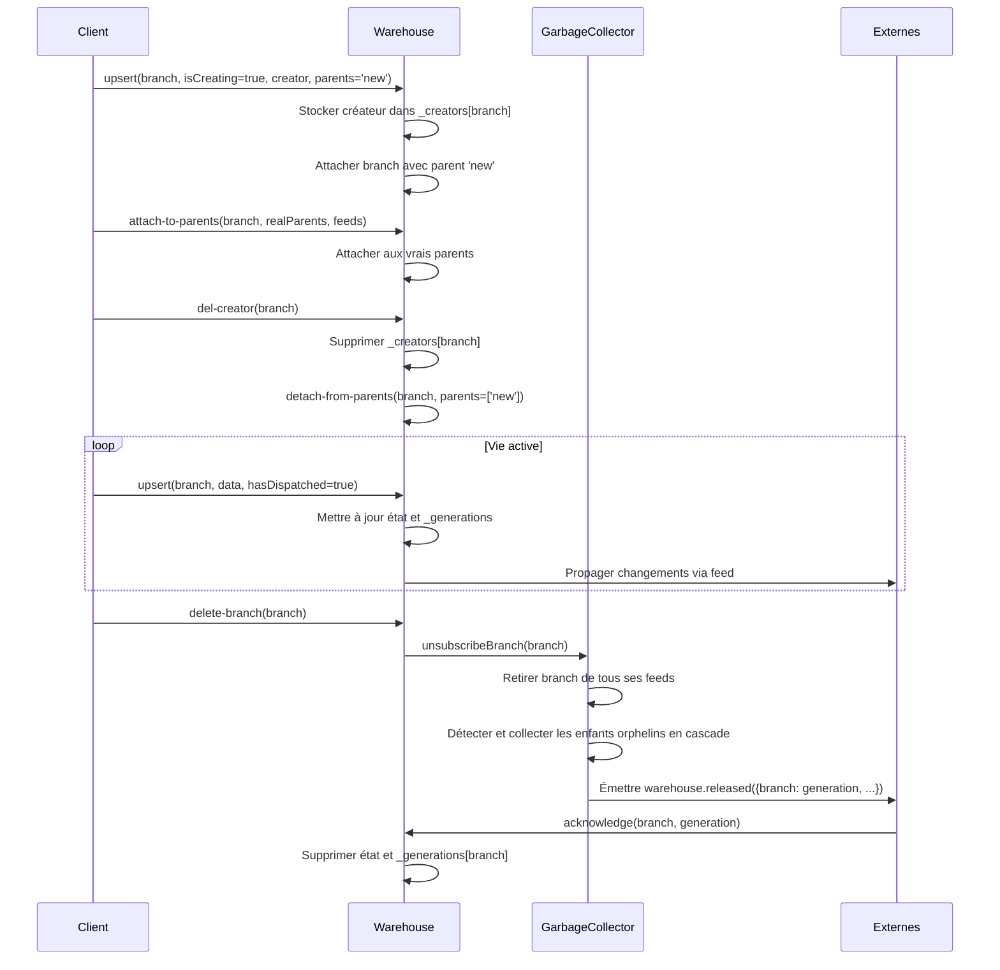
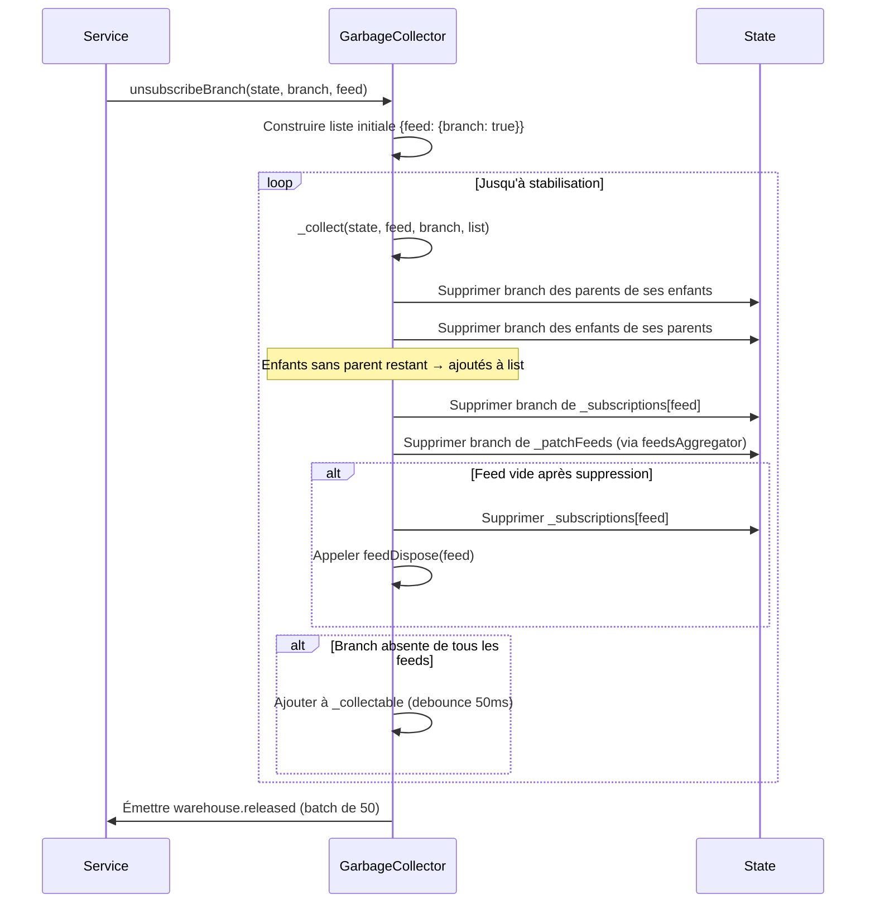
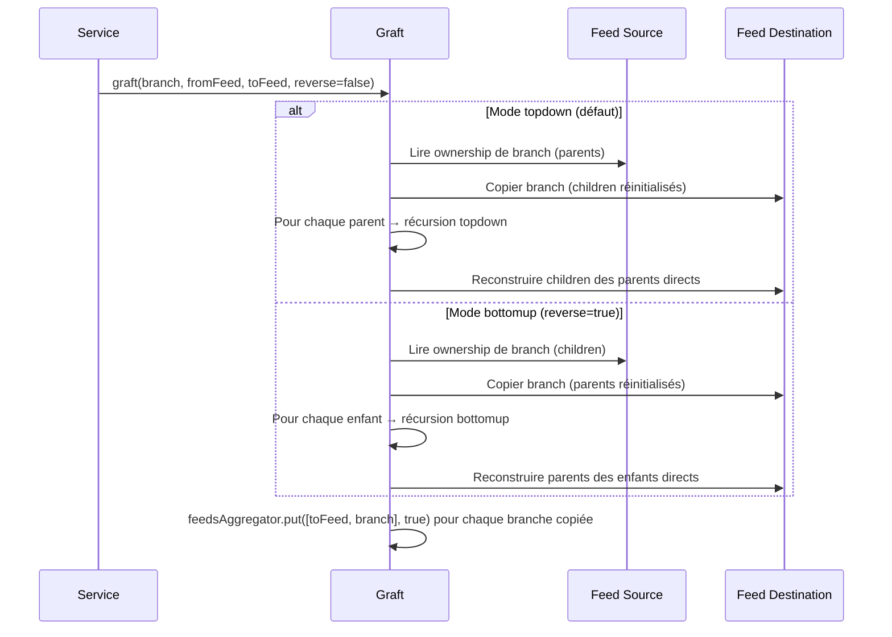

# Warehouse Ownerships et Feeds

## Aperçu

Le module `goblin-warehouse` constitue le système central de gestion d'état et de souscriptions du framework Xcraft. Il implémente un mécanisme sophistiqué d'**ownership** (propriété) et de **feeds** (flux de données) qui permet de gérer le cycle de vie des acteurs et la distribution des changements d'état à travers l'application.

Le warehouse fonctionne comme un registre centralisé où chaque acteur (identifié par une **branch**) peut être rattaché à un ou plusieurs **feeds** via des relations de parenté. Ce système garantit qu'un acteur reste en vie tant qu'au moins un parent le référence dans au moins un feed, et qu'il soit automatiquement collecté par le garbage collector lorsque plus aucune référence n'existe.

## Sommaire

- [Structure des données](#structure-des-données)
- [Branches et identifiants](#branches-et-identifiants)
- [Feeds et souscriptions](#feeds-et-souscriptions)
- [Relations d'ownership](#relations-downership)
- [Cycle de vie des acteurs](#cycle-de-vie-des-acteurs)
- [Mécanisme de garbage collection](#mécanisme-de-garbage-collection)
- [Propagation des changements](#propagation-des-changements)
- [Gestion des patches](#gestion-des-patches)
- [Attachement et détachement](#attachement-et-détachement)
- [Greffage entre feeds](#greffage-entre-feeds)
- [Outils de diagnostic](#outils-de-diagnostic)

## Fonctionnement

### Structure des données

Le warehouse maintient un état global structuré autour de plusieurs collections principales :

**`_subscriptions`** : Contient l'ensemble des feeds actifs et leurs branches souscrites. Chaque feed possède une collection de branches avec leurs relations de parenté (parents/children) et optionnellement des vues spécifiques par branch.

**`_generations`** : Stocke les numéros de génération de chaque branch, utilisés pour la synchronisation et la détection des changements. Inclut également un flag `hasDispatched` indiquant si l'acteur a terminé son initialisation et peut être propagé aux feeds.

**`_creators`** : Maintient une référence vers l'acteur créateur de chaque branch, utilisée durant la phase transitoire de création. Elle est supprimée dès que l'attachement aux parents définitifs est confirmé via `del-creator`.

**`_patchFeeds`** : Liste des feeds configurés pour recevoir des patches différentiels plutôt que l'état complet. Un feed est inscrit dans cette liste dès l'appel à `subscribe`.

**`_feedsAggregator`** : Instance de `MapAggregator` qui collecte les changements par batch (délai de 50 ms) avant de les diffuser aux feeds concernés, optimisant ainsi les performances réseau. Il est initialisé une seule fois via la quête interne `_init`.

### Branches et identifiants

Une **branch** représente l'identifiant unique d'un acteur dans le système. Elle peut prendre deux formes :

- **Singleton** : Identifiant simple sans suffixe `@` (ex : `goblin-desktop`). Ces acteurs sont uniques et persistent durant toute la durée de vie de l'application. Ils ne peuvent pas être collectés par le garbage collector.
- **Instance** : Identifiant avec suffixe d'instance séparé par `@` (ex : `goblin-desktop@main-desktop`). Ces acteurs peuvent être créés et détruits dynamiquement.

La présence ou l'absence du caractère `@` dans l'identifiant est utilisée de façon systématique dans le code pour distinguer les deux types, notamment pour décider si une branch peut être soumise à la garbage collection.

### Feeds et souscriptions

Un **feed** constitue un canal de distribution des changements d'état. Chaque feed maintient sa propre vue des branches qui l'intéressent et reçoit uniquement les notifications concernant celles-ci.

Il existe deux manières d'inscrire des branches dans un feed :

- **`subscribe`** : Déclare un feed et y inscrit une liste de branches avec auto-ownership (chaque branch devient son propre parent). Le feed est également marqué dans `_patchFeeds` pour recevoir des patches différentiels.
- **`upsert`** avec paramètre `feeds` : Inscrit une branch dans un ou plusieurs feeds lors de son upsert, en spécifiant explicitement les parents.

La souscription établit une relation bidirectionnelle : le feed déclare son intérêt pour certaines branches, et le warehouse enregistre cette souscription en initialisant les structures d'ownership correspondantes.

Des **vues partielles** peuvent être définies pour chaque branch dans un feed, permettant de filtrer les propriétés transmises avec `with` (liste des propriétés incluses) ou `without` (liste des propriétés exclues).

```mermaid
sequenceDiagram
    participant Client
    participant Warehouse
    participant Aggregator
    participant Feed

    Client->>Warehouse: subscribe(feed, branches)
    Warehouse->>Warehouse: Créer _subscriptions[feed]
    Warehouse->>Warehouse: Marquer _patchFeeds[feed]
    Warehouse->>Warehouse: Initialiser ownership (auto-parent) pour chaque branch

    loop Pour chaque changement d'état
        Warehouse->>Aggregator: put([feed, branch], true/false)
        Aggregator->>Aggregator: Attendre 50 ms (debounce batch)
        Aggregator->>Warehouse: Déclencher handleChanges(feeds, branches)
        Warehouse->>Feed: Envoyer <feed>.changed (patch ou état complet)
    end
```

### Relations d'ownership

Le système d'ownership repose sur des relations parent-enfant entre les branches au sein de chaque feed. Chaque entry de branch dans un feed maintient deux collections :

**`parents`** : Liste des branches qui "possèdent" cette branch dans ce feed. Une branch reste vivante dans un feed tant qu'elle a au moins un parent valide. Un parent spécial `'new'` est utilisé temporairement lors de la création pour éviter la collection immédiate.

**`children`** : Liste des branches "possédées" par cette branch dans ce feed. Lorsqu'une branch est supprimée, ses enfants qui se retrouvent sans autre parent sont automatiquement collectés en cascade.

Ces relations forment un graphe dirigé par feed. Le système supporte l'**auto-ownership** : une branch peut être son propre parent et son propre enfant, ce qui est le cas pour les branches racines d'un feed (souscrites via `subscribe` ou upsertées avec elles-mêmes comme parent). L'auto-ownership est symbolisé par un indicateur visuel `↺` dans la visualisation graphique DOT.

Une même branch peut exister dans plusieurs feeds simultanément avec des relations de parenté différentes dans chacun. La suppression d'une branch d'un feed n'affecte pas sa présence dans les autres feeds.

### Cycle de vie des acteurs

Le cycle de vie d'un acteur dans le warehouse suit plusieurs étapes distinctes, pilotées par les quêtes du warehouse :

**Phase de création** : Lors de l'upsert initial avec `isCreating: true`, la branch est enregistrée avec un parent temporaire `'new'` et la référence vers son créateur est stockée dans `_creators`. Cette phase évite la collection immédiate pendant l'initialisation asynchrone.

**Phase d'attachement** : La branch est rattachée à ses parents définitifs via `attach-to-parents`. Le parent `'new'` est ensuite supprimé via `del-creator`, qui déclenche également un `detach-from-parents` pour le parent `'new'`. Si aucun attachement valide n'est possible (parents inconnus), la branch est immédiatement collectée.

**Vie active** : L'acteur reçoit des mises à jour d'état via des upserts successifs. Seules les instances (branches contenant `@`) dont le flag `hasDispatched` est positionné à `true` sont incluses dans la propagation aux feeds. Les singletons sont toujours propagés.

**Suppression** : La branch est détachée de ses parents via `detach-from-parents` ou directement via `delete-branch`. La suppression déclenche le garbage collector qui détermine quelles branches deviennent orphelines.

**Collection et libération** : Le garbage collector émet un événement `warehouse.released` avec la liste des branches collectées et leurs générations. Les composants externes peuvent réagir à cet événement (via `acknowledge`) pour effectuer leur propre nettoyage avant la suppression définitive de l'état.

```mermaid
sequenceDiagram
    participant Client
    participant Warehouse
    participant GC as GarbageCollector
    participant Externes

    Client->>Warehouse: upsert(branch, isCreating=true, creator, parents='new')
    Warehouse->>Warehouse: Stocker créateur dans _creators[branch]
    Warehouse->>Warehouse: Attacher branch avec parent 'new'

    Client->>Warehouse: attach-to-parents(branch, realParents, feeds)
    Warehouse->>Warehouse: Attacher aux vrais parents

    Client->>Warehouse: del-creator(branch)
    Warehouse->>Warehouse: Supprimer _creators[branch]
    Warehouse->>Warehouse: detach-from-parents(branch, parents=['new'])

    loop Vie active
        Client->>Warehouse: upsert(branch, data, hasDispatched=true)
        Warehouse->>Warehouse: Mettre à jour état et _generations
        Warehouse->>Externes: Propager changements via feed
    end

    Client->>Warehouse: delete-branch(branch)
    Warehouse->>GC: unsubscribeBranch(branch)
    GC->>GC: Retirer branch de tous ses feeds
    GC->>GC: Détecter et collecter les enfants orphelins en cascade
    GC->>Externes: Émettre warehouse.released({branch: generation, ...})

    Externes->>Warehouse: acknowledge(branch, generation)
    Warehouse->>Warehouse: Supprimer état et _generations[branch]
```

### Mécanisme de garbage collection

Le garbage collector est implémenté dans la classe `GarbageCollector` et opère en plusieurs étapes pour garantir la cohérence des références.

**Détection des orphelins** : Lorsque la méthode `_collect` est invoquée pour une branch dans un feed, elle met à jour les relations des parents et des enfants. Si un enfant se retrouve sans aucun parent restant dans ce feed (et qu'il n'est pas la branch elle-même), il est ajouté à la liste de collecte pour ce feed.

**Collection en cascade** : La suppression déclenche une boucle qui continue tant que de nouvelles branches orphelines sont détectées. À chaque itération, les branches orphelines découvertes lors de l'itération précédente sont à leur tour collectées, provoquant potentiellement de nouveaux orphelins, et ainsi de suite jusqu'à stabilisation complète du graphe.

**Vérification inter-feeds** : Avant de supprimer définitivement l'état global d'une branch (la donnée elle-même, pas seulement son entrée dans un feed), le garbage collector vérifie si cette branch existe encore dans au moins un autre feed. Si c'est le cas, l'état global est conservé. Ce n'est que lorsque la branch disparaît de tous les feeds qu'elle est mise en file d'attente pour suppression définitive.

**Auto-release pour les orcs** : Les branches dont l'identifiant commence par `goblin-orc@` bénéficient d'un mécanisme d'auto-release : elles sont supprimées immédiatement de l'état global sans attendre l'`acknowledge`. Cela reflète leur nature éphémère (représentant des connexions clientes temporaires).

**Collection différée par batch** : Les branches collectées sont accumulées dans une Map `_collectable` associant chaque branch à sa génération. Un mécanisme de debounce (50 ms) regroupe les branches en lots de 50 pour l'émission de l'événement `warehouse.released`, évitant une surcharge d'événements lors de suppressions massives.

```mermaid
sequenceDiagram
    participant Service
    participant GC as GarbageCollector
    participant State

    Service->>GC: unsubscribeBranch(state, branch, feed)
    GC->>GC: Construire liste initiale {feed: {branch: true}}

    loop Jusqu'à stabilisation
        GC->>GC: _collect(state, feed, branch, list)
        GC->>State: Supprimer branch des parents de ses enfants
        GC->>State: Supprimer branch des enfants de ses parents
        Note over GC: Enfants sans parent restant → ajoutés à list
        GC->>State: Supprimer branch de _subscriptions[feed]
        GC->>State: Supprimer branch de _patchFeeds (via feedsAggregator)
        alt Feed vide après suppression
            GC->>State: Supprimer _subscriptions[feed]
            GC->>GC: Appeler feedDispose(feed)
        end
        alt Branch absente de tous les feeds
            GC->>GC: Ajouter à _collectable (debounce 50ms)
        end
    end

    GC->>Service: Émettre warehouse.released (batch de 50)
```

**Nettoyage des feeds vides** : Lorsque la dernière branch est supprimée d'un feed, le feed entier est retiré de `_subscriptions` et de `_patchFeeds`. La fonction `feedDispose` est appelée pour nettoyer les structures annexes : l'historique d'états précédents (`previousBranchStates`) et le cache de changements (`changeFeeds`).

### Propagation des changements

Le système de propagation utilise un mécanisme d'agrégation pour optimiser les performances et éviter les envois redondants.

**Agrégation par `MapAggregator`** : Chaque modification d'une branch dans un feed est signalée au `MapAggregator` via `feedsAggregator.put([feed, branch], exists)`, où `exists` est `true` pour un ajout/modification et `false` pour une suppression. L'agrégateur attend 50 ms avant de déclencher le traitement batch via l'événement local `<warehouse-changes>`.

**Filtrage par `hasDispatched`** : Pour les branches instances (contenant `@`), seules celles dont le flag `_generations[branch].hasDispatched` est `true` sont incluses dans les changements envoyés. Ce flag est positionné lors de l'upsert avec le paramètre `_goblinHasDispatched`. Les singletons (sans `@`) sont toujours inclus.

**Détection des changements réels** : Avant d'envoyer un patch, le système compare le nouvel état de la branch avec l'état précédent mémorisé dans `changeFeeds`. Si les états sont identiques (comparaison par valeur via `equals` d'Immutable.js), aucun patch n'est émis, évitant les transmissions inutiles.

**Gestion des vues** : Si une vue est définie pour une branch dans un feed (via `attach-to-parents` avec le paramètre `view`), l'état transmis est filtré selon cette vue avant calcul du patch et envoi.

### Gestion des patches

Le système distingue deux modes de transmission selon l'historique du feed.

**Premier envoi (état complet)** : Lors de la première notification à un feed (absence d'entrée dans `previousBranchStates`), le warehouse calcule et envoie l'état complet de toutes les branches du feed avec `_xcraftPatch: false`. Une entrée `_generation: 0` est initialisée dans `previousBranchStates` pour ce feed.

**Envois suivants (patches différentiels)** : Pour les notifications ultérieures, seules les branches modifiées sont incluses. Pour chaque branch modifiée, `xcraft-immutablediff` calcule le diff entre l'état précédent (mémorisé dans `previousBranchStates[feed][branch]`) et le nouvel état. L'envoi utilise `_xcraftPatch: true`. Une suppression est représentée par la valeur `false` pour la branch dans les patches.

**Numéro de génération** : Chaque envoi (complet ou patch) inclut un numéro de génération incrémental (`_generation`) qui permet au destinataire de détecter des messages perdus ou reçus dans le désordre.

**Resynchronisation** : La quête `resend` force l'envoi de l'état complet d'un feed en réinitialisant partiellement `previousBranchStates`. Elle est utile après une déconnexion ou pour récupérer un état de référence.

**Synchronisation forcée** : La quête `syncChanges` provoque la libération immédiate des changements en attente dans l'agrégateur pour un feed donné, sans attendre l'expiration du délai de 50 ms.

### Attachement et détachement

Ces opérations permettent de modifier dynamiquement les relations d'ownership sans passer par un upsert complet.

**`attach-to-parents`** : Ajoute un ou plusieurs parents à une branch dans un ou plusieurs feeds. Le système vérifie que les parents existent avant d'établir la relation. Pour les instances (contenant `@`), si un parent n'existe pas dans le feed et que la branch n'a aucun autre parent, un avertissement est émis et la branch est immédiatement collectée. Les singletons et les branches `goblin-cache@*` sont exemptés de cette vérification. La quête retourne un booléen indiquant si l'attachement a réussi. Si la branch existe en tant que donnée mais n'a pu être attachée à aucun feed, son état global est supprimé via `remove-batch`.

**`detach-from-parents`** : Retire des parents d'une branch dans un ou plusieurs feeds. Supporte les patterns avec wildcards (`*`) pour cibler plusieurs parents simultanément. Si la branch se retrouve sans parent dans un feed après détachement, elle est automatiquement collectée pour ce feed. Si la branch porte le même nom qu'un feed et disparaît des souscriptions de ce feed, l'unsubscribe complet du feed est déclenché automatiquement.

**`feedSubscriptionAdd` / `feedSubscriptionDel`** : Raccourcis pour attacher ou détacher une branch dans un feed spécifique, avec auto-parenté par défaut si aucun parent n'est spécifié.

**Validation à la création** : Lors de l'upsert avec `isCreating: true`, si tous les parents possibles sont inconnus dans tous les feeds ciblés, la branch est immédiatement collectée avec un avertissement.

### Greffage entre feeds

L'opération de greffage (`graft`) copie une sous-arborescence depuis un feed source vers un feed de destination, sans modifier le feed source.

**Mode descendant (topdown, par défaut)** : En partant de la branch cible, le greffage remonte récursivement vers ses parents jusqu'aux racines, copiant toutes les branches rencontrées dans le feed de destination. Les enfants de chaque branch copiée sont réinitialisés à vide pour éviter les références pendantes, puis reconstruits pour les parents directs de la branch cible. Ce mode permet de copier le contexte hiérarchique complet d'une branch.

**Mode ascendant (bottomup, `reverse: true`)** : En partant de la branch cible, le greffage descend récursivement vers ses enfants, copiant toute la sous-arborescence avale. Les parents de la branch racine copiée sont réinitialisés à vide. Ce mode permet d'exporter une branch et tous ses descendants vers un autre feed.

Dans les deux cas, les branches copiées sont signalées à l'agrégateur (`feedsAggregator.put`) pour que le feed de destination reçoive leur état lors de la prochaine propagation.

```mermaid
sequenceDiagram
    participant Service
    participant Graft
    participant FeedSource as Feed Source
    participant FeedDest as Feed Destination

    Service->>Graft: graft(branch, fromFeed, toFeed, reverse=false)

    alt Mode topdown (défaut)
        Graft->>FeedSource: Lire ownership de branch (parents)
        Graft->>FeedDest: Copier branch (children réinitialisés)
        Graft->>Graft: Pour chaque parent → récursion topdown
        Graft->>FeedDest: Reconstruire children des parents directs
    else Mode bottomup (reverse=true)
        Graft->>FeedSource: Lire ownership de branch (children)
        Graft->>FeedDest: Copier branch (parents réinitialisés)
        Graft->>Graft: Pour chaque enfant → récursion bottomup
        Graft->>FeedDest: Reconstruire parents des enfants directs
    end

    Graft->>Graft: feedsAggregator.put([toFeed, branch], true) pour chaque branche copiée
```

### Outils de diagnostic

Le warehouse fournit plusieurs outils pour diagnostiquer et déboguer les problèmes de cohérence.

**`checkOrphan`** : Identifie les branches qui référencent des parents inexistants dans l'état global (le parent est listé dans l'ownership mais absent de la donnée principale). Révèle des problèmes de synchronisation ou des créations croisées entre feeds.

**`checkDangling`** : Trouve les branches présentes dans l'état global mais absentes de tous les feeds. Ces branches sont des fuites mémoire potentielles qui ne seront jamais collectées ni propagées.

**`check`** : Exécute séquentiellement `checkOrphan` et `checkDangling` et journalise les résultats avec leur contexte (feed, branch, parent manquant).

**`status`** : Affiche dans les logs un résumé structuré de toutes les souscriptions actives et de leurs générations, utile pour une inspection rapide de l'état du warehouse.

**`graph`** : Génère deux fichiers DOT représentant les relations d'ownership, en utilisant la bibliothèque `xcraft-jsonviz`. Le premier utilise le layout `fdp` avec des nœuds simplifiés (mode `simple`), le second utilise le layout `dot` avec des nœuds détaillés affichant namespace, id, présence de l'état et génération (mode `complexe`). Les nœuds sont colorés selon le type de namespace (worker, workitem, feeder, updater, dispatcher) et les relations auto-propriétaires sont signalées par le symbole `↺`.

**`query`** : Permet d'effectuer des recherches sur les données du warehouse avec filtrage par type de branch, par liste d'ids, et par valeurs de propriétés (filtres AND). Supporte les projections via `view` et peut être restreint à un feed spécifique.

**`get-branch-subscriptions`** : Retourne la liste des feeds contenant une branch donnée, avec la possibilité de filtrer certains feeds par préfixe.

**Interface d'exploration** : Le widget `warehouse-explorer` fournit une interface graphique interactive pour visualiser les feeds (liste cliquable), leurs souscriptions (arborescence triée) et les relations entre branches sous forme de graphe utilisant Cytoscape avec layout Dagre (orientation gauche-droite). Il expose également l'outil de vérification `check` pour détecter orphelins et branches pendantes depuis l'interface.

**Métriques** : La fonction `getMetrics` expose pour chaque feed le nombre de branches souscrites (`total`) ainsi que le nombre total d'entrées dans le warehouse (`entries.total`), utile pour le monitoring.

---

_Ce document a été généré automatiquement à partir du code source et mis à jour pour refléter l'état actuel du module._
